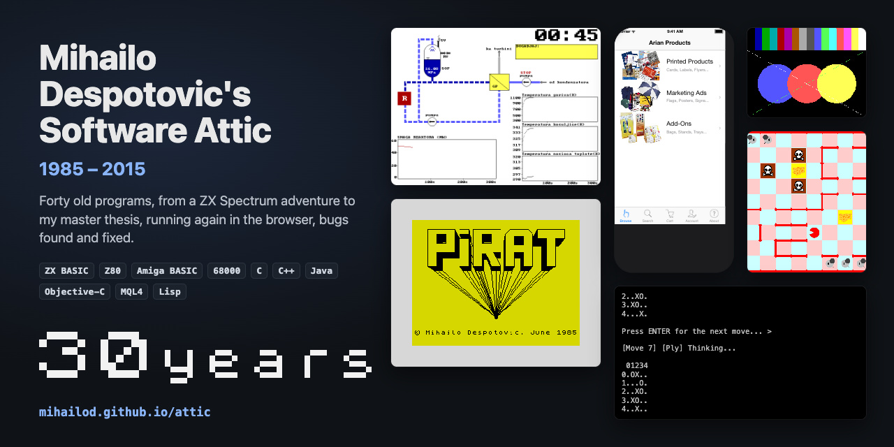

# Mihailo Despotovic's Software Attic 1985-2015

*(For my post-2015 work see my [GitHub](https://github.com/mihailod).)*

HTML version of this page: [mihailod.github.io/attic](https://mihailod.github.io/attic/)

Historical programs I wrote for fun, school, interviews, and certifications since my childhood, brought back to life to run in any browser. Some are unchanged, others contain fixes for bugs discovered during modernization.

All programs originally written in **Java** unless stated otherwise.

> “Beware of bugs in the above code; I have only proved it correct, not tried it.”
>
> ― Donald Knuth

## 2015

- **[Producers and Consumers](https://mihailod.github.io/attic/producerconsumer/pc.html)** · **December**  
  A number of [producers and consumers](https://en.wikipedia.org/wiki/Producer%E2%80%93consumer_problem) share one buffer, waiting when it is full or empty. Watch them take turns, then break it with if instead of while, or notify() instead of notifyAll().

- **[CloudWatch Log4j Appender](https://github.com/mihailod/cloudwatch-log4j-appender)** · **June**  
  A [Log4j 2](https://logging.apache.org/log4j/2.12.x/) appender that sends an application's log events to [AWS CloudWatch](https://en.wikipedia.org/wiki/Amazon_CloudWatch) Logs, in batches flushed every few seconds, to a new log stream each time the application starts. Configured in the Log4j configuration like any other appender. Made during my tenure at Virtual Instruments (now [Virtana](https://www.virtana.com)), and open-sourced per company policy.

## 2014

- **[YU SciFi iPhone App (Objective-C)](https://github.com/mihailod/yu-scifi)** · **February**  
  A catalogue of the science fiction, fantasy and horror books published in [Serbo-Croatian](https://en.wikipedia.org/wiki/Serbo-Croatian) in [Yugoslavia](https://en.wikipedia.org/wiki/Socialist_Federal_Republic_of_Yugoslavia) during the 20th century: 510 titles in 17 categories, from Kentaur and Polaris to X-100 SF, with their cover art, browsable and searchable with no network connection. Each book links to Google, [Goodreads](https://www.goodreads.com) and Wikipedia, and, for collectors, to the used-book sites of Serbia, Croatia, Slovenia and Bosnia and Herzegovina. Made at my startup, MiRteh, it was on the [App Store](https://en.wikipedia.org/wiki/App_Store_(Apple)) until 2022, and is back there since August 2026.

- **[Arian Web Shop iOS App Prototype (Objective-C)](https://mihailod.github.io/attic/ArianPrototype/arian.html)** · **January**  
  A web shop iPhone app prototype for [Arian GmbH](https://www.arian.com/en/) (Austria), from the time of my startup, MiRteh, meant to lead to a big project that was later cancelled. It demoed product discovery (browse and search), a product-dependent configurator, a shopping cart and account management. Here it runs in the browser as it looked on iOS 7, with screenshots of the real app running today, and fixes for prices computed in floats, a cent or a few euros off.

## 2013

- **[Davor's Trader (Java, MQL4)](https://mihailod.github.io/attic/Trader/trader.html)** · **December**  
  A contract job from the time of my startup, MiRteh, for [Davor Urošević](https://www.linkedin.com/in/davoru/), a [FOREX](https://en.wikipedia.org/wiki/Foreign_exchange_market) trader: a [breakout strategy](https://en.wikipedia.org/wiki/Breakout_(technical_analysis)) for EUR/USD, begun as a Java program and finished as an Expert Advisor for [MetaTrader 4](https://en.wikipedia.org/wiki/MetaTrader_4) in [MQL4](https://docs.mql4.com/). Here the Expert Advisor runs in a small simulated MetaTrader 4 tester, with fixes for a sell with no breakout and for stopping for good after a weekend, among others.

## 2012

- **[Lisp Notebook (Lisp)](https://mihailod.github.io/attic/playground-lisp/lisp.html)** · **January**  
  My notes from learning [Common Lisp](https://en.wikipedia.org/wiki/Common_Lisp): exercises from [Budimac et al.](https://plus.cobiss.net/cobiss/cg/cnr_latn/data/cobib/50749959), [Henderson’s *Functional Programming*](https://www.goodreads.com/book/show/5838062-functional-programming-application-and-implementation) and *[SICP](https://en.wikipedia.org/wiki/Structure_and_Interpretation_of_Computer_Programs)*, runnable and editable in a small Lisp interpreter written for the page, with notes on my slips.

## 2011

- **[Conway's Game of Life](https://mihailod.github.io/attic/life/life.html)** · **February**  
  The [classic cellular automaton](https://en.wikipedia.org/wiki/Conway's_Game_of_Life) on a 500 × 350 board that wraps around at the edges.

- **[3D Rendering from Scratch](https://mihailod.github.io/attic/SImple3DDemo/simple3d.html)** · **February**  
  A hand-built 3D pipeline: rotate a cube or tetrahedron, with [hidden surfaces](https://en.wikipedia.org/wiki/Hidden-surface_determination), [z-ordering](https://en.wikipedia.org/wiki/Z-order) and [shading](https://en.wikipedia.org/wiki/Shading). Based on [Michael Abrash](https://en.wikipedia.org/wiki/Michael_Abrash)'s [Black Book](https://www.goodreads.com/en/book/show/946151.Graphics_Programming_Black_Book).

- **[Bresenham's Line Algorithm](https://mihailod.github.io/attic/Bresenham/bresenham.html)** · **February**  
  Which pixels to light up to [draw a straight line](https://en.wikipedia.org/wiki/Bresenham%27s_line_algorithm). Drag the ends and watch it work step by step. My version solves the basic direction and gets the other seven by mirroring it.

## 2009

- **[Permutations by Insertion](https://mihailod.github.io/attic/permutations/permutations.html)** · **May**  
  Every ordering of the letters of a word, built by inserting one letter at a time into every position. Watch it step by step.

- **[Project Euler Solutions](https://mihailod.github.io/attic/ProjectEuler/euler.html)** · **March**  
  Solutions to 28 of the math and programming problems on [Project Euler](https://projecteuler.net), each runnable with its output and running time.

## 2008

- **[Odds of Success over Repeated Tries](https://mihailod.github.io/attic/tries/tries.html)** · **June**  
  How many tries it takes to be fairly sure of at least one success, given the chance of each try.

- **[Mortgage or Invest?](https://mihailod.github.io/attic/investmortgage/im.html)** · **May**  
  Is it better to pay cash for a house, or take a mortgage and invest the savings? A year-by-year comparison, taxes included.

- **[Prime Number Generator and RSA Example](https://mihailod.github.io/attic/primgen/primgen.html)** · **May**  
  Generate random primes, test a number by [trial division](https://en.wikipedia.org/wiki/Trial_division), and encrypt a message with [RSA](https://en.wikipedia.org/wiki/RSA_cryptosystem) built from scratch.

## 2007

- **[Parallel Sum Benchmark](https://mihailod.github.io/attic/ParallelSum/parallelsum.html)** · **June**  
  Add up a big array of numbers on one processor core, then split the work across several and see how much faster it gets.

- **[CPU Cache Impact: Row vs Column Matrix Addition](https://mihailod.github.io/attic/BigMatrix/bigmatrix.html)** · **April**  
  Add two big matrices row by row, then column by column: the same additions, several times slower, because of the processor’s [cache](https://en.wikipedia.org/wiki/CPU_cache). Then split the rows across all cores.

## 2005

- **[The Birthday Paradox](https://mihailod.github.io/attic/birthdayparadox/birthday.html)** · **September**  
  How many people must be in a room before two probably [share a birthday](https://en.wikipedia.org/wiki/Birthday_problem)? Only 23. See the curve, and fill rooms with random birthdays to check it.

- **[Dining Philosophers](https://mihailod.github.io/attic/DiningPhilosophers/dinner.html)** · **August**  
  [Dining philosophers](https://en.wikipedia.org/wiki/Dining_philosophers_problem) around a table share one fork between each pair, and need two to eat. Watch them think, wait and eat, and see the naive way deadlock while mine never does.

- **[Merging Line Segments](https://mihailod.github.io/attic/ea/segments.html)** · **August**  
  Sort line segments on the number line and merge the ones that overlap. My answer to [Electronic Arts](https://en.wikipedia.org/wiki/Electronic_Arts)' 90-minute Java interview problem.

- **[Linked Lists and Binary Search Trees (C)](https://mihailod.github.io/attic/playground-c/lists.html)** · **July**  
  The classic interview data structures, from my C practice: a [linked list](https://en.wikipedia.org/wiki/Linked_list) (2005) and a [binary search tree](https://en.wikipedia.org/wiki/Binary_search_tree) (2011), every operation animated step by step. With fixes for the memory bugs I found, which the printed output never showed.

## 2003

- **[ChuChu Cheese (finished but needs more levels)](https://mihailod.github.io/attic/ChuChuRocket/chuchu.html)** · **October**  
  My version of the Puzzle mode of Sega’s [ChuChu Rocket!](https://en.wikipedia.org/wiki/ChuChu_Rocket!) for the [Dreamcast](https://en.wikipedia.org/wiki/Dreamcast), my favorite game: place arrows so every mouse reaches the cheese and none meets a cat. With my 2003 artwork, sounds, levels and level editor.

- **[Word Finder for Letter Puzzles](https://mihailod.github.io/attic/lps/lps.html)** · **October**  
  Find every dictionary word that can be spelled from a set of letters.

- **[TeekoTeacher](https://mihailod.github.io/attic/tt/tt.html)** · **June**  
  Learn [Teeko](https://en.wikipedia.org/wiki/Teeko) with move advice from a database of played games. Based on my master thesis [“Machine Learning in Strategic Games”](https://archive.org/details/ucenje-u-strateskim-igrama). Written for my paper [“TeekoTeacher: A Tool for Learning Good Teeko Strategies”](https://archive.org/details/teeko-teacher), given at the [CAPS4](http://europia.org/communication/CAPS4/index.htm) conference in Glasgow, Scotland, UK, and published in its [proceedings](http://europia.org/edition/livres/cogn/caps4.htm).

- **[Sorting Algorithms Visualized](https://mihailod.github.io/attic/sorting/sorting.html)** · **January**  
  Watch ten sorting algorithms at work, from [bubble sort](https://en.wikipedia.org/wiki/Bubble_sort) to [quick](https://en.wikipedia.org/wiki/Quicksort), [heap](https://en.wikipedia.org/wiki/Heapsort) and [merge sort](https://en.wikipedia.org/wiki/Merge_sort).

- **[Tic-Tac-Toe with Minimax and Alpha-Beta](https://mihailod.github.io/attic/ttt/ttt.html)** · **January**  
  Play against a computer that searches the whole [game tree](https://en.wikipedia.org/wiki/Game_tree), with or without [alpha-beta pruning](https://en.wikipedia.org/wiki/Alpha%E2%80%93beta_pruning). A tiny part of my master thesis [“Machine Learning in Strategic Games”](https://archive.org/details/ucenje-u-strateskim-igrama).

- **[Boolean Expression Parser](https://mihailod.github.io/attic/BooleanParser/parser.html)** · **January**  
  Parse boolean expressions like #1# AND ( #2# OR NOT #3# ) by [recursive descent](https://en.wikipedia.org/wiki/Recursive_descent_parser), and see the [parse tree](https://en.wikipedia.org/wiki/Parse_tree), [postfix form](https://en.wikipedia.org/wiki/Reverse_Polish_notation) and [truth table](https://en.wikipedia.org/wiki/Truth_table).

## 2002

- ★ *Successfully defended my master thesis [“Machine Learning in Strategic Games”](https://archive.org/details/ucenje-u-strateskim-igrama) at the [University of Belgrade](https://en.wikipedia.org/wiki/University_of_Belgrade). My advisors were [Đorđe Dugošija](https://poincare.matf.bg.ac.rs/~dugosija/) and [Vladimir Srdanović](https://www.linkedin.com/in/vladimir-srdanovic-8670184/), and the commission Đorđe Dugošija, [Srđan Stanković](https://automatika.etf.bg.ac.rs/sr/nastavnici/92-nastavnici/171-prof-dr-srđan-stanković) and [Vera Vujičić-Kovačević](https://nds.edu.rs/clanovi/prof-dr-vera-v-vujicic/?lang=lat).* · **May 13**

- **[JT (Java Tetris)](https://mihailod.github.io/jt/)** · **April**  
  The classic [falling-blocks game](https://en.wikipedia.org/wiki/Tetris), written as a [Java applet](https://en.wikipedia.org/wiki/Java_applet). Modernized separately in its own repository, [mihailod/jt](https://github.com/mihailod/jt). [▶ Play it in your browser](https://mihailod.github.io/jt/).

## 2001

- **[Serbian Cafe Forums Reader](https://mihailod.github.io/attic/screader/screader.html)** · **September**  
  A desktop reader for the Serbian Cafe forums that [screen-scraped](https://en.wikipedia.org/wiki/Web_scraping) the site’s pages. The forums closed permanently on December 3, 2024.

- **[Fly by Night Airline Booking](https://mihailod.github.io/attic/SCJD/flybynight.html)** · **January**  
  Search flights and book seats from two clients sharing one database, with [record locking](https://en.wikipedia.org/wiki/Record_locking) so they can’t double-book. My [Sun Certified Java Developer](https://en.wikipedia.org/wiki/Oracle_Certification_Program) assignment.

## 1999

- **[Teeko (C)](https://mihailod.github.io/attic/mscthesis/teeko.html)** · **March**  
  Play [Teeko](https://en.wikipedia.org/wiki/Teeko) against the program of my master thesis [“Machine Learning in Strategic Games”](https://archive.org/details/ucenje-u-strateskim-igrama), which picks its moves with [heuristics](https://en.wikipedia.org/wiki/Heuristic), a [minimax](https://en.wikipedia.org/wiki/Minimax) search and a memory of the positions that won, and learns from every game. Runs here as it did in a Windows console, keeping what it learns in your browser, with the memories of the thesis experiments to load, and fixes for a search that seldom played its best move, a player O that read the memory backwards, a draw offered on every turn, and an opening that could hang. I finished it in California, after moving to the USA in 1998.

## 1998

- ★ *Moved to California. For the rest of the journey, see [my LinkedIn](https://www.linkedin.com/in/mihailod/).* · **June**

- **[WAV (C++)](https://mihailod.github.io/attic/pre-usa-c-cpp/WAV/wav.html)** · **May**  
  A Windows program that shows any file as a wave, drawn from 100 of its bytes. Runs here as it did, menus, toolbar and dialogs included, with fixes for sampling the wrong bytes, writing past the end of an array, and crashing on the smallest files. I wrote it while learning [MFC](https://en.wikipedia.org/wiki/Microsoft_Foundation_Class_Library) and [Visual C++](https://en.wikipedia.org/wiki/Microsoft_Visual_C%2B%2B) 5.0 in haste, before emigrating to the USA for my first job there.

## 1997

- **[N Queens (C++)](https://mihailod.github.io/attic/pre-usa-c-cpp/Ndama/ndama.html)** · **April**  
  Place [n queens](https://en.wikipedia.org/wiki/Eight_queens_puzzle) on a chessboard so that none attacks another, solved by recursion and [backtracking](https://en.wikipedia.org/wiki/Backtracking). Runs as it did in [DOS](https://en.wikipedia.org/wiki/MS-DOS), in Serbian with an English translation, plus the backtracking step by step. My term project for the Applications of Artificial Intelligence class, during my MSc studies at the [University of Belgrade](https://en.wikipedia.org/wiki/University_of_Belgrade).

- **[A Random Number Generator (C++)](https://mihailod.github.io/attic/pre-usa-c-cpp/SM/sm.html)** · **February**  
  A “random” 16-bit number made by iterating the rule A(i) = A(i−1) OR A(i+1) on random bits. Runs as it did in [DOS](https://en.wikipedia.org/wiki/MS-DOS), in Serbian with an English translation, and shows how little randomness comes out. With fixes for a typo that left a bit to chance, among others. My term project for the Statistical Methods in Artificial Intelligence class, during my MSc studies at the [University of Belgrade](https://en.wikipedia.org/wiki/University_of_Belgrade).

- **[HTM2TXT (C++)](https://mihailod.github.io/attic/pre-usa-c-cpp/Htm2txt/htm2txt.html)** · **February**  
  A [DOS](https://en.wikipedia.org/wiki/MS-DOS) command-line tool that turns a web page into plain text by leaving out everything between < and >. With a fix for a byte that made it stop early.

## 1996

- ★ *Graduated, and began my master's studies in [Artificial Intelligence](https://en.wikipedia.org/wiki/Artificial_intelligence) at the [University of Belgrade](https://en.wikipedia.org/wiki/University_of_Belgrade).* · **May**

- **[GRAB (C++)](https://mihailod.github.io/attic/pre-usa-c-cpp/Grab/grab.html)** · **March**  
  A [DOS](https://en.wikipedia.org/wiki/MS-DOS) utility that saved the [EGA](https://en.wikipedia.org/wiki/Enhanced_Graphics_Adapter)/[VGA](https://en.wikipedia.org/wiki/Video_Graphics_Array) graphics screen to a file and loaded it back by copying its four [bit planes](https://en.wikipedia.org/wiki/Bit_plane) straight from video memory. Here the video card is simulated: paint, save, load, and see the planes.

- **[Intro-style Fade-in/out Star (C++)](https://mihailod.github.io/attic/pre-usa-c-cpp/Intro/intro.html)** · **March**  
  A little [DOS](https://en.wikipedia.org/wiki/MS-DOS) graphics demo: the 16 colors of the [VGA](https://en.wikipedia.org/wiki/Video_Graphics_Array) palette, then a star that flashes at a random spot at every key press. Every screen checked against the original code, with its settings to play with.

## 1995

- **[Varijacione metode [Variational Methods] (C)](https://mihailod.github.io/attic/pre-usa-c-cpp/Vm/vm.html)** · **September**  
  My seminar paper for the Numerical Methods class, during my undergraduate studies of Mathematics and Computer Science at the [University of Belgrade](https://en.wikipedia.org/wiki/University_of_Belgrade), [Faculty of Mathematics](https://www.matf.bg.ac.rs/eng/): a [boundary value problem](https://en.wikipedia.org/wiki/Boundary_value_problem) solved approximately by [Galerkin's method](https://en.wikipedia.org/wiki/Galerkin_method), [collocation](https://en.wikipedia.org/wiki/Collocation_method) and [least squares](https://en.wikipedia.org/wiki/Least_squares), drawn in [VGA](https://en.wikipedia.org/wiki/Video_Graphics_Array) graphics and compared with the exact solution. Runs as it did in [DOS](https://en.wikipedia.org/wiki/MS-DOS), in Serbian with an English translation, with fixes for a missing term that made every method solve the wrong equation, among others. The menu and the expression evaluator are [Vuksan Pejović](https://www.gamesdatabase.org/developer-vuksan_pejovic)'s libraries.

- **[Knjige [Books] (C)](https://mihailod.github.io/attic/pre-usa-c-cpp/KNJIGE/knjige.html)** · **August**  
  A catalogue of my books for [DOS](https://en.wikipedia.org/wiki/MS-DOS), “knjige” meaning books: page through them, sort and search by any field, and print one. It comes with my catalogue as I last saved it, in 1998, in Serbian with an English translation, and with fixes for a hang after a search and a sort that lost most of the books, among others.

- **[LOFT Eksperiment [The LOFT Experiment] (C)](https://mihailod.github.io/attic/pre-usa-c-cpp/LOFT/loft.html)** · **March**  
  A simulation of the [LOFT](https://www.oecd-nea.org/jcms/pl_25963/loss-of-fluid-test-loft-project) (Loss of Fluid Test) L9-3 experiment of 1982 at the [Idaho National Laboratory](https://en.wikipedia.org/wiki/Idaho_National_Laboratory), where a model of a [pressurized water reactor](https://en.wikipedia.org/wiki/Pressurized_water_reactor) lost its feedwater and was not shut down, made with [Aleksandar Ćirilović](https://www.linkedin.com/in/aleksandar-cirilovic-0a59b659/) during my undergraduate studies at the [University of Belgrade](https://en.wikipedia.org/wiki/University_of_Belgrade): the reactor's loop animated in [VGA](https://en.wikipedia.org/wiki/Video_Graphics_Array) graphics for the five minutes of the experiment, its power and temperatures plotted as they go, a click on any part explaining it, and a description in [hypertext](https://en.wikipedia.org/wiki/Hypertext). Runs as it did in [DOS](https://en.wikipedia.org/wiki/MS-DOS), in Serbian with an English translation, with fixes for graphs that say kelvins for degrees Celsius and a stray word in the description, among others. The hypertext engine is [Vuksan Pejović](https://www.gamesdatabase.org/developer-vuksan_pejovic)'s.

## 1994

- ★ *Three months in [Campinas](https://en.wikipedia.org/wiki/Campinas), Brazil, on an internship at [IMECC](https://www.ime.unicamp.br/en), [UNICAMP](https://en.wikipedia.org/wiki/State_University_of_Campinas): mathematical modeling of [problems in coastal biology](https://www.ime.unicamp.br/~biomat/inicia.htm), on [Sun SPARCstations](https://en.wikipedia.org/wiki/SPARCstation) under Unix and in [Mathematica 2.0](https://en.wikipedia.org/wiki/Wolfram_Mathematica).* · **October to December**

## 1991

- ★ *Began my undergraduate studies of Mathematics and Computer Science at the [University of Belgrade](https://en.wikipedia.org/wiki/University_of_Belgrade), [Faculty of Mathematics](https://www.matf.bg.ac.rs/eng/).* · **September**

## 1990

- **[A-Profy Amiga Fanzine](https://archive.org/details/a-profy-yugoslav-amiga-fanzine-1-july-1990)** · **July**  
  The first [Amiga](https://en.wikipedia.org/wiki/Amiga) [fanzine](https://en.wikipedia.org/wiki/Fanzine) in the region, which I produced, edited and published in Yugoslavia, in Serbian. Two issues came out, in July and August 1990, both now on the Internet Archive: [issue 1](https://archive.org/details/a-profy-yugoslav-amiga-fanzine-1-july-1990) and [issue 2](https://archive.org/details/a-profy-yugoslav-amiga-fanzine-2-august-1990). Not a program, but it took many of the same skills.

## 1989

- **[Prsten [The Ring] (Amiga BASIC, Motorola MC68000 assembly)](https://mihailod.github.io/attic/1989Apr/prsten.html)** · **March**  
  A [text adventure](https://en.wikipedia.org/wiki/Interactive_fiction) with still pictures for the [Commodore Amiga](https://en.wikipedia.org/wiki/Amiga), inspired by *[The Lord of the Rings](https://en.wikipedia.org/wiki/The_Lord_of_the_Rings)*, written in [Amiga BASIC](https://en.wikipedia.org/wiki/AmigaBASIC) with some routines in [MC68000](https://en.wikipedia.org/wiki/Motorola_68000) assembly. The game itself was sadly not preserved; what is left is my ad for it in the (then) Yugoslav computer magazine *[Moj Mikro](https://en.wikipedia.org/wiki/Moj_mikro)*, here with its text in Serbian and English.

## 1988

- ★ *[Moj Mikro](https://en.wikipedia.org/wiki/Moj_mikro) publishes [my review](https://archive.org/details/ports-of-call-for-amiga-review) of the Amiga game [Ports of Call](https://en.wikipedia.org/wiki/Ports_of_Call_(video_game)). I rate it 8 of 10 🙂 Officially my first published article.* · **November**

- ★ *Got a [Commodore Amiga 500](https://en.wikipedia.org/wiki/Amiga_500), and the journey levels up.* · **July 5**

## 1985

- **[Pirat [Pirate] (ZX Spectrum BASIC, Zilog Z80 assembly)](https://mihailod.github.io/attic/1985Jun/pirat.html)** · **June**  
  A [text adventure](https://en.wikipedia.org/wiki/Interactive_fiction) with still pictures for the [ZX Spectrum](https://en.wikipedia.org/wiki/ZX_Spectrum), written over the summer school break in [ZX Spectrum BASIC](https://en.wikipedia.org/wiki/Sinclair_BASIC), with [Z80](https://en.wikipedia.org/wiki/Zilog_Z80) assembly routines to draw and load the pictures. Nothing of it was preserved; here is its loading screen, recreated from memory, loading as if from tape.

- ★ *Got a [Sinclair ZX Spectrum 48K](https://en.wikipedia.org/wiki/ZX_Spectrum), and the journey begins…* · **April 15**

## Running them

Each program is a single web page with no dependencies. Open its `.html` file in a browser, directly from disk, or at [mihailod.github.io/attic](https://mihailod.github.io/attic/). The original source code is kept in each project's `src` folder.

## Credits

Fly by Night Airline Booking includes code and data that Sun Microsystems supplied with the Sun Certified Java Developer assignment: the `DataInfo`, `FieldInfo` and `DatabaseException` classes, the skeleton of the `Data` class, and the sample flight data (`db` and `testascii.txt`).
